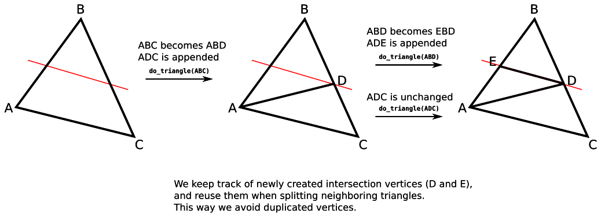

# Minimalistic Mesh Slicer

This piece of code takes a triangular mesh (given as an input OBJ file) and slices it with a plane (given as an input JSON file).

An example OBJ file is given in [torus.obj](./torus.obj).  
An example JSON file for the plane is given in [plane.json](./plane.json).  
An example output OBJ file is given in [output.obj](./output.obj), in case you don't want to compile/run the program.

This will not actually "slice" the mesh into two distinct meshes.
Rather, it will add edges to the mesh at its intersection with the plane (subdivising triangles etc),
but the algorithm can easily be adapted to instead split the mesh into two proper submeshes.

Everything is in one single source file ([slicer.cpp])(./slicer.cpp), it is very minimalistic (that's the point).

### Usage

Compile:

    g++ -Wall slicer.cpp -o slicer

Run:

    ./slicer torus.obj plane.json

And open output.obj in MeshLab/Blender/etc.

The only dependency is the C++ Standard Template Library. The code is C++11-compatible.

### Algorithm

I used a very simple data structure with only vertex and triangle data.
There is no incidence structure in the Slicer class besides that (no edge data).
If you want to do more serious things, a real mesh data structure should be implemented (e.g. half-edge data structure).

The algorithm works in the following way:

* Initialize empty intersections dictionary
* Set t := 0
* While t < triangles.size():
    * If triangles[t] does not intersect the plane, set t := t+1 and continue
    * If triangles[t] does intersect the plane:
        * Let [ijk] := triangles[t] be the triangle vertices
        * Assume w.l.o.g. that segment [jk] intersect the plane
        * Let m := intersection of [jk] with the plane
        * If intersections[j,k] is undefined:
            * Set intersections[j,k] := m
            * Add vertex m to the mesh
        * Append triangle [ijm] to the mesh
        * Replace triangles[t] by triangle [imk]
        * Continue (without incrementing t)

This should slice the mesh without introducing duplicated vertices. See image below for a visual explanation.

All new vertices/triangles are appended at the end of the data arrays (no insertions and no deletions).

### Issues

* Only minimal error handling (I assume the OBJ file is well-formed, etc).
* Intersection computation can be inaccurate (I think because of floating point arithmetic).
* I use hard-coded regular expressions for parsing the JSON.
* The code isn't easily extensible because of the rudimentary data structure.

